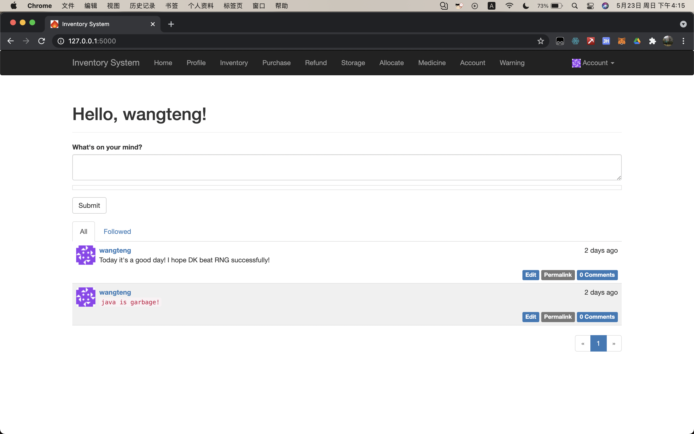
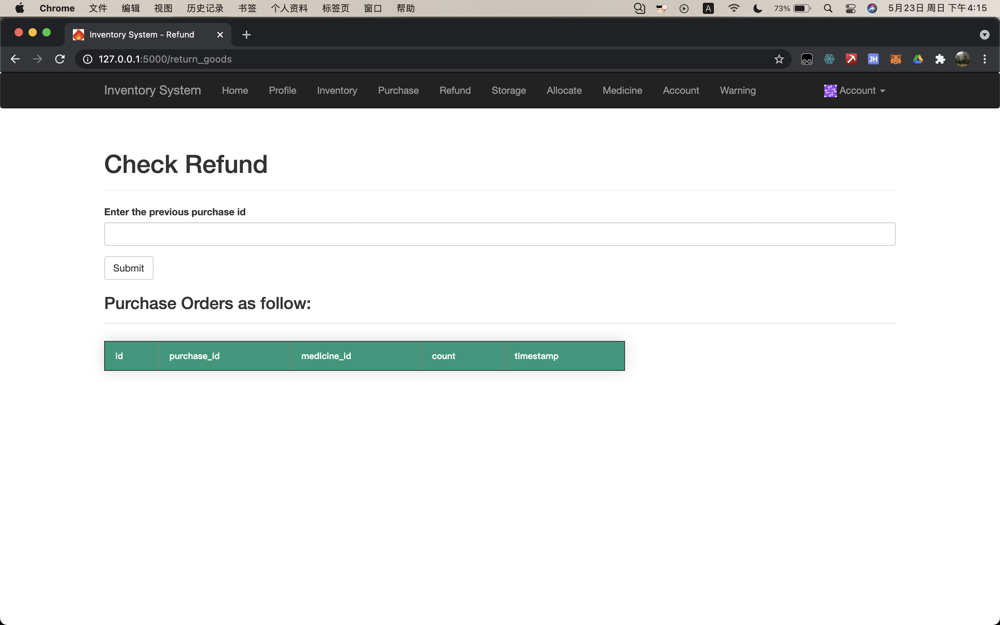
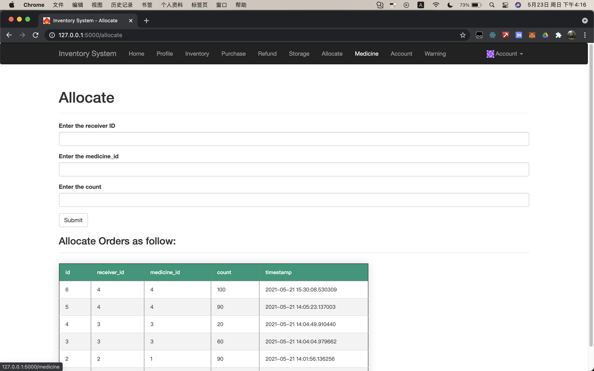

# purchasing-management-system-

premise:
Some drug materials are allocated to nursing homes and medical institutions through group procurement, including procurement, warehousing, allocation, return, inventory, inventory warning, inventory accounting, etc

To build "Home", "Profile", "Inventory", "Purchase", "Refund", "Storage", "Allocate" section to realize these functions. 

There will show images about this System:

